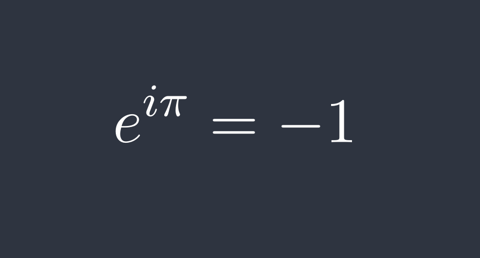



[\\( \LaTeX \\)](https://en.wikipedia.org/wiki/LaTeX) is a document preparation system. It is particularly adept for typesetting math, and can be quite powerful when extended with various packages.

I primarily use [KDE `kile`](https://invent.kde.org/office/kile) as my go-to editor, along with my GNU/Linux distribution 's [`texlive`](https://en.wikipedia.org/wiki/TeX_Live) package. If you want to use your favorite editor, but it's lacking native \\( \TeX \\) support, consider using the [`texlab`](https://github.com/latex-lsp/texlab) LSP.

In order to save time, I made a handful of templates:

### [Document Cover](https://github.com/gsobell/texplates/tree/home/cover-page)
Generate a cover for your document, inspired by the familiar standard GNU Documentation covers.

### [CS Template](https://github.com/gsobell/texplates/tree/home/cs-article)
Includes packages useful for CS (e.g. `algorithm2e`)

### [Math Template](https://github.com/gsobell/texplates/tree/home/math-article)
Includes packages useful for math (e.g. `mathtools`, `tikz`, `tikz-cd`)

### [Bi-Directional](https://github.com/gsobell/texplates/tree/home/bidi-article)
For documents with bidirectional text. Example uses Hebrew, but good for any other RTL language. I prefer the explicitly delineated LTR and RTL blocks to the implicit ones found in most word processors, for ease of editing. Be sure to compile with [`XeLaTeX`](https://en.wikipedia.org/wiki/XeTeX) for unicode support.

## [fast-cv](https://github.com/gsobell/fast-cv)
_faster than making a cup of noodles_ :ramen:

A outline for a CV, without having to learn a new packages, new commands or mess around with installing `.sty` files.

Links:




