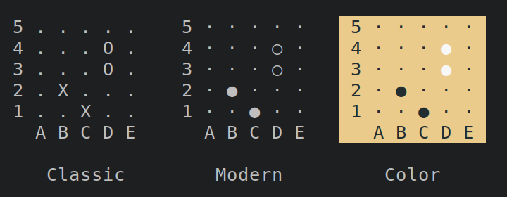
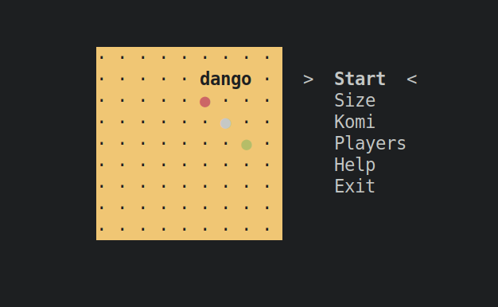

a Go board for the terminal :dango:

It all started as `sed` script for colorizing the ascii output of `gnugo`.



Now, it's a full-fledged go board, with arrow/vim key and mouse support.



To try now without installing:
```sh
python <(curl -s https://raw.githubusercontent.com/gsobell/dango/dan/dango.py)
```

The [`GTP` (Go Text Protocol)](https://www.lysator.liu.se/~gunnar/gtp/) outlines two components: an engine and a controller. This is the controller, for the engine see [goma]().

Github:




