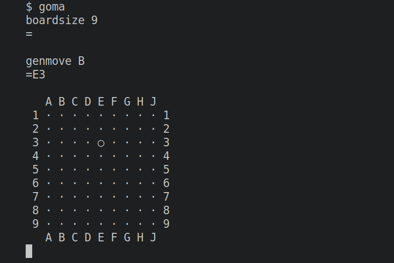

a stochastic Go engine written in python

This project is a work-in-progress. The API is complete, but none of the logic has been implemented yet.



<!--```
$ goma

boardsize 9
=

genmove B
=E5

   A B C D E F G H J
 1 · · · · · · · · · 1
 2 · · · · · · · · · 2
 3 · · · · ○ · · · · 3
 4 · · · · · · · · · 4
 5 · · · · · · · · · 5
 6 · · · · · · · · · 6
 7 · · · · · · · · · 7
 8 · · · · · · · · · 8
 9 · · · · · · · · · 9
   A B C D E F G H J

```-->

The [`GTP` (Go Text Protocol)](https://www.lysator.liu.se/~gunnar/gtp/) outlines two components: an engine and a controller. This is the engine, for the controller see [dango]().


Github:




