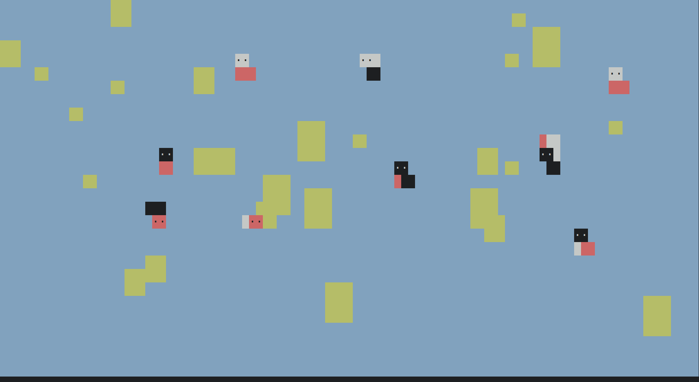

a koi pond for your terminal :carp_streamer:



## includes:
- blue water
- green lily pads
- koi fish

to run without installing:

```sh
python <(curl -s https://raw.githubusercontent.com/gsobell/koipond/home/koipond.py)
```

Github:




